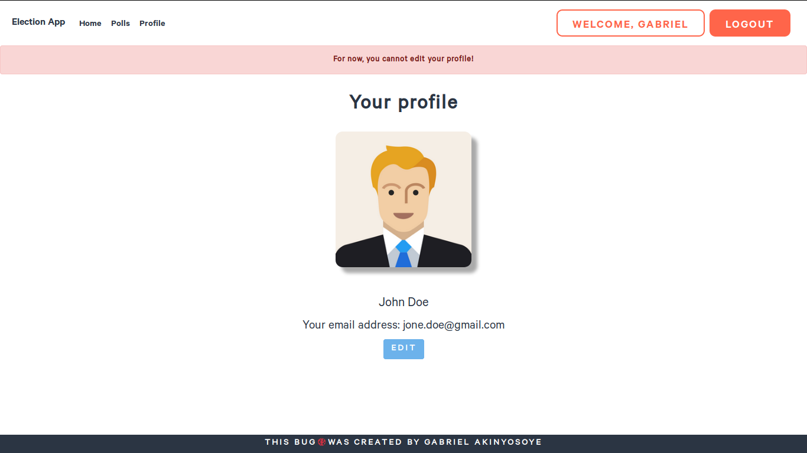

# election-app-mapoly-api

Mapoly Election  Application Programming Interface (API).

## Deployment

Happily deployed [here](https://majestic-cuyahoga-valley-08131.herokuapp.com/)
## How to install

```php
php artisan migrate
```
or  you can run it with the seeds

```php
php artisan migrate --seed
```
You can proceed to serve the application by running

```php
php artisan serve
```

## Issues
If any issue is detected please feel free to raise it here on GitHub,
I will kindly look through it.


## Screenshots

